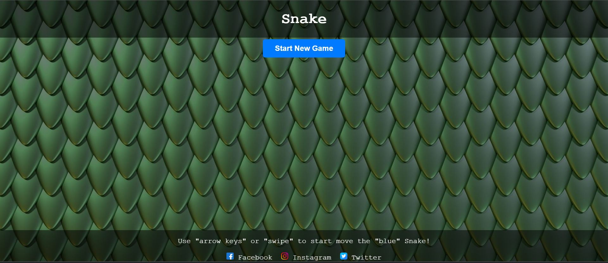
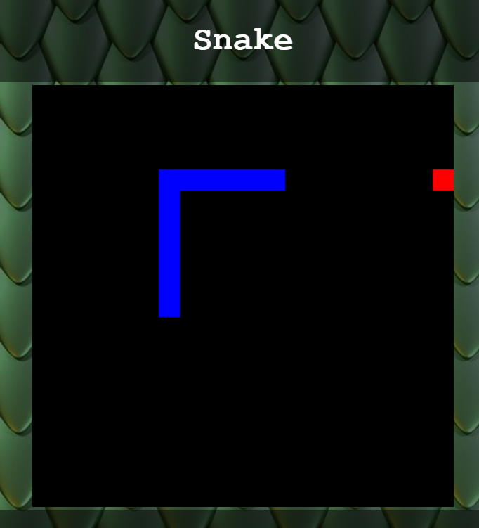
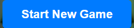
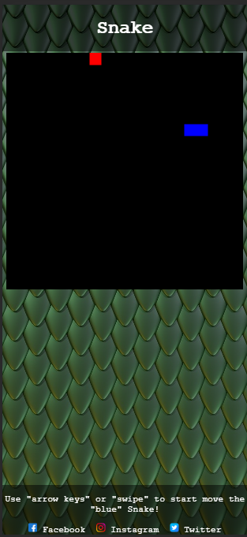
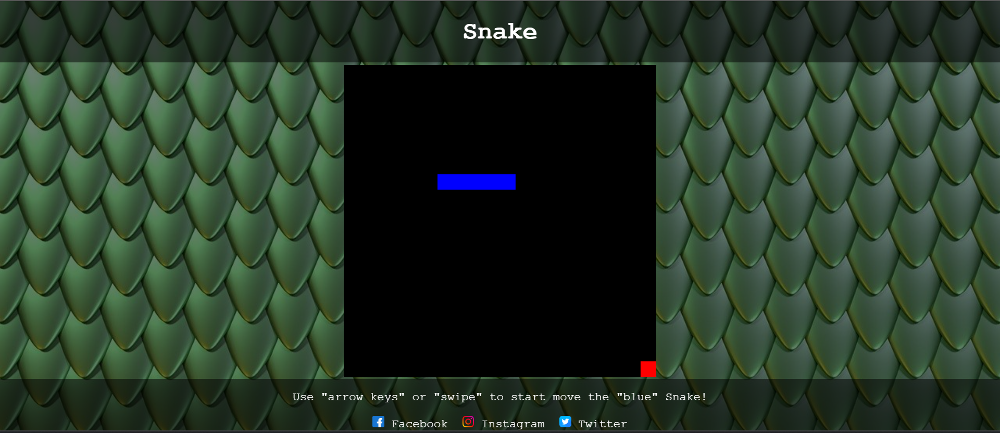
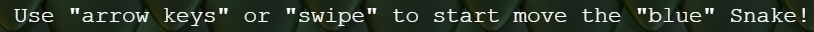
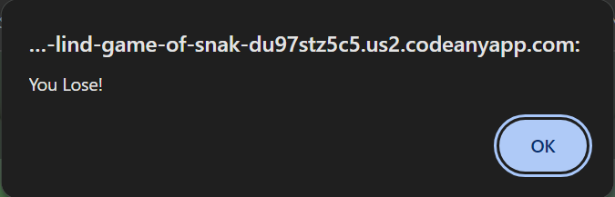

# Game Of Snake

## Table of Contents

- [Game Of Snake](#game-of-snake)
  - [Table of Contents](#table-of-contents)
  - [Introduction](#introduction)
  - [Gameplay](#gameplay)
  - [Controls](#controls)
  - [Visuals and Style](#visuals-and-style)
  - [Features](#features)
  - [Technologies Used](#technologies-used)
  - [How to Play](#how-to-play)
  - [Author Notes](#author-notes)
  - [Website Goals](#website-goals)
  - [Getting Started](#getting-started)
    - [Prerequisites](#prerequisites)
  - [Acknowledgments](#acknowledgments)
  - [Credits](#credits)

## Introduction

Welcome to the Snake Game! This simple classic game allows you to control a snake and collect food to grow while avoiding collisions with the walls and yourself. This repository contains the code for the Snake Game implemented in HTML, CSS, and JavaScript.

## Gameplay

The player controls a blue snake on a black game board. The objective is to navigate the snake to consume red food items that randomly appear. Each time the snake eats, it grows longer. The challenge is to keep the snake from running into the game board edges or into itself.

## Controls

- **Desktop:** Use the arrow keys to change the direction of the snake.
- **Mobile:** Swipe in the direction you want the snake to move.

## Visuals and Style

- The game has a clean, minimalistic interface with a snake skin pattern background.
- The snake is colored blue, and the food is red, providing a clear contrast against the black game board.
- A "Start New Game" button is prominently displayed at the center of the page.
<!-- markdownlint-disable-next-line MD033 -->

<!-- markdownlint-disable-next-line MD033 -->

<!-- markdownlint-disable-next-line MD033 -->

<!-- markdownlint-disable-next-line MD033 -->

## Features

- Responsive design for playing on various devices.
- Keyboard and touch input support.
- Dynamic snake growth upon eating food.
- Randomized placement of food items.
- Game over conditions with restart capability.
<!-- markdownlint-disable-next-line MD033 -->

<!-- markdownlint-disable-next-line MD033 -->

<!-- markdownlint-disable-next-line MD033 -->

<!-- markdownlint-disable-next-line MD033 -->

<!-- markdownlint-disable-next-line MD033 -->

<!-- markdownlint-disable-next-line MD033 -->

## Technologies Used
<!-- markdownlint-disable-next-line MD033 -->

<!-- markdownlint-disable-next-line MD033 -->

- HTML
- JavaScript
- CSS

<!-- markdownlint-disable-next-line MD012 -->
## How to Play

- Open the game in a web browser.
- Click "Start New Game" or tap the button on a touch device.
- Use the arrow keys or swipe to move the snake.

## Author Notes

Enjoy this nostalgic journey with a simple yet classic Snake game. Perfect for quick gaming sessions and suitable for all ages.

## Website Goals

- Easy to use for everyone who wants to play a classic game.
- Very simple design for a more "classic" feeling while playing.
- Make a person smile while playing this wonderful classic game.

## Getting Started

### Prerequisites

Before you can run the game, you'll need a web browser that supports HTML5 and JavaScript.

## Acknowledgments

I acknowledge and take full responsibility that this is my own work, and code thats barrowed or inspired for others is in "Credits" below.

- A special thank you to the **JavaScript and HTML5 Canvas communities** for the wealth of information available, which greatly assisted in understanding the fundamentals of game development in a web environment.
- Thanks to all my friends who dedicated their time to play the game and provide feedback, leading to continuous improvement and fine-tuning.
- Acknowledgment of **[Stack Overflow](https://stackoverflow.com/)** and its community for being a reliable source of solutions and best practices in web development, especially in troubleshooting and debugging.

## Credits

- **Game Concept**: Inspired by the classic snake game, acknowledging its original creators and the various iterations that have contributed to its enduring popularity in the gaming world.

- I have used some code from this totorial "https://www.youtube.com/watch?v=baBq5GAL0_U&t=916s" Author: Kenny Yipp Coding
